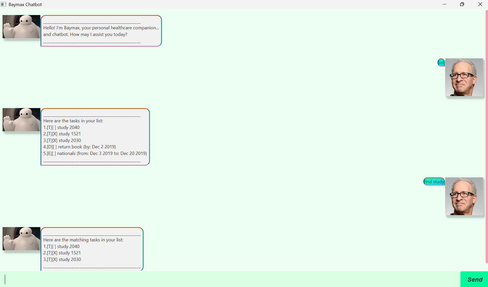

# Baymax User Guide

Welcome to **Baymax**, your personal task management companion!  
This guide explains how to interact with Baymax using commands and what output to expect.

---

## Product Screenshot



*Full GUI window of Baymax. The product name should be visible in the title bar.*

---

## Introduction

Baymax helps you organize your tasks, deadlines, and events. You can:

- Add, remove, and list tasks.
- Mark tasks as done or undone.
- Search for tasks by keyword.
- Get consistent, formatted messages for all actions.

All outputs follow a friendly, bordered format.

---

## Commands

### 1. Adding a Todo Task

**Command:**  
`todo Buy groceries`

**Expected Output:**
````
___________________________________________________  
Task successfully added. I will monitor it with care:  
[ ] Buy groceries  
Now you have 1 tasks in the list.
___________________________________________________  

````
---
### 2. Adding a Deadline

**Command:**  
`deadline Submit report /by 2025-09-20`

**Expected Output:**
````
___________________________________________________  
Task successfully added. I will monitor it with care:  
[ ] Submit report (by: 20 Sep 2025)  
Now you have 2 tasks in the list.
___________________________________________________  
````
---

### 3. Marking a Task as Done

**Command:**  
`done 1`

**Expected Output:**
````
___________________________________________________  
Task successfully marked. I will monitor it with care:  
[X] Buy groceries
___________________________________________________  
````
---

### 4. Unmarking a Task

**Command:**  
`undone 1`

**Expected Output:**
````
___________________________________________________  
Task successfully unmarked. I will monitor it with care:  
[ ] Buy groceries
___________________________________________________  
````
---

### 5. Removing a Task

**Command:**  
`delete 1`

**Expected Output:**
````
___________________________________________________  
Task removed, your task is now lighter:  
[ ] Buy groceries  
Now you have 1 tasks in the list.
___________________________________________________  
````
---

### 6. Listing All Tasks

**Command:**  
`list`

**Expected Output:**
````
___________________________________________________  
Here are the tasks in your list:
1.[X] Buy groceries
2.[ ] Submit report (by: 20 Sep 2025)
___________________________________________________  
````
---

### 7. Finding Tasks by Keyword

**Command:**  
`find groceries`

**Expected Output:**
````
___________________________________________________  
Here are the matching tasks in your list:
1.[X] Buy groceries
___________________________________________________  
````
---

### 8. Adding an Event

**Command:**  
`event Team meeting /at 2025-09-21 14:00-15:00`

**Expected Output:**
````
___________________________________________________  
Task successfully added. I will monitor it with care:  
[ ] Team meeting (at: 21 Sep 2025 14:00 - 15:00)  
Now you have 3 tasks in the list.
___________________________________________________  
````
---

## Tips

- Commands are **case-insensitive**.
- Always include **task index numbers** for commands like `done` and `delete`.
- Use the exact date format when adding deadlines/events.
- The GUI shows all tasks clearly, with status `[ ]` for not done and `[X]` for done.
